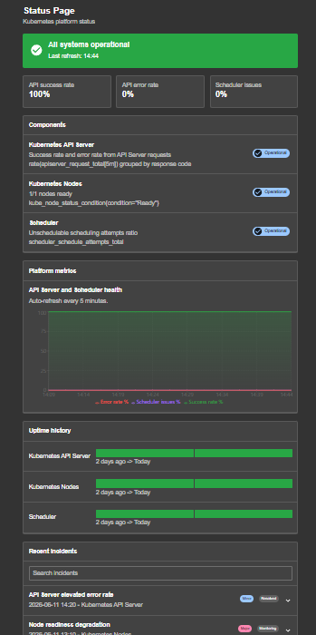
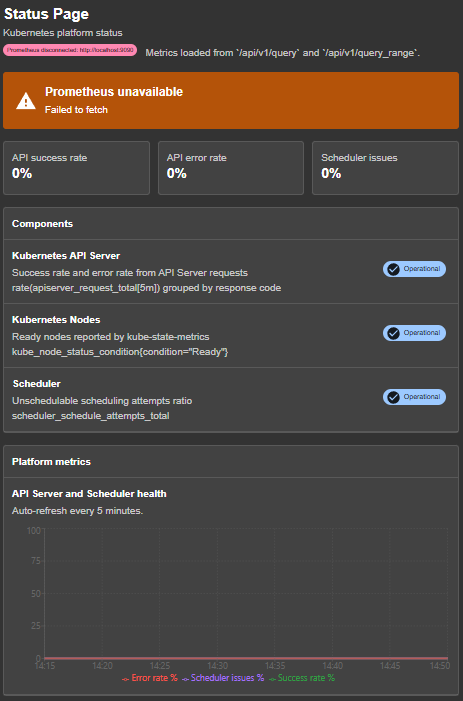
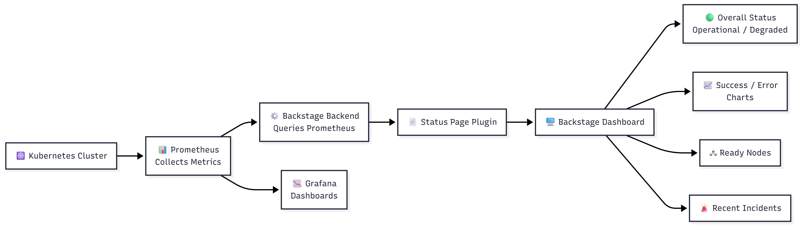

# Status Page Backstage

Simple Backstage plugin that displays live Prometheus metrics for a Kubernetes
platform.

## About

Status Page Backstage is a reusable Backstage plugin for displaying Kubernetes
platform health from Prometheus.

Project link:

```text
https://github.com/NizmoDev/Status-Page-BackStage
```

Suggested GitHub topics:

```text
backstage, backstage-plugin, prometheus, kubernetes, status-page, monitoring, observability, devops, grafana, developer-portal
```

The page is available at `/statuspage` and shows:

- Prometheus connection status
- Overall platform status
- API success rate
- API error rate
- Scheduler issues
- Kubernetes ready nodes
- Prometheus-powered charts

## Preview

When Prometheus is running, the page shows live values from the configured
Prometheus URL.



When Prometheus is stopped or unreachable, the page detects it and shows that
the metrics source is disconnected.



## How it works

Prometheus collects metrics from Kubernetes. Backstage loads this plugin. The
plugin queries Prometheus and renders the metrics inside the Backstage UI.



The plugin currently reads Prometheus directly from the frontend, or through the
Backstage proxy if you configure one.

## Important

This plugin does not create a Kubernetes cluster, install Prometheus, install
Grafana, or run `kubectl port-forward` automatically.

To see real values, you need:

- A Backstage app.
- A Prometheus instance.
- Kubernetes metrics in Prometheus if you want the Kubernetes cards to work.
- A Prometheus URL reachable from Backstage.

Grafana is optional. This plugin reads Prometheus directly.

## Prerequisites

Install the tools you need for your setup:

- Node.js and Yarn for Backstage.
- `kubectl` if you use Kubernetes.
- Helm if you want to install Prometheus with `kube-prometheus-stack`.
- A Kubernetes cluster such as `kind`, `minikube`, Docker Desktop Kubernetes,
  or a remote cluster.

Check that Backstage dependencies are installed:

```shell
yarn install
```

Check that `kubectl` can reach your cluster:

```shell
kubectl get nodes
```

## Clone Backstage From GitHub

Skip this section if you already have a Backstage repository.

Clone the official Backstage repository:

```shell
git clone https://github.com/backstage/backstage.git
```

Go into the repository:

```shell
cd backstage
```

Install dependencies:

```shell
yarn install
```

Start Backstage once to verify that the example app works before installing this
plugin:

```shell
yarn start
```

Open:

```text
http://localhost:3000
```

When this works, stop Backstage and continue with the plugin installation below.

## Quick Install In An Existing Backstage App

Run this from the root of your Backstage repository, for example the
`backstage` folder cloned above:

```shell
yarn workspace app add NizmoDev/Status-Page-BackStage
```

If your frontend workspace is not named `app`, replace `app` with your app
workspace name.

## Add The Plugin To Backstage

### New frontend system

Open your Backstage app entry point and add the plugin to `createApp`.

```ts
import statuspagePlugin from "status-page-backstage";

const app = createApp({
  features: [statuspagePlugin],
});
```

The plugin contributes the page at:

```text
/statuspage
```

### Classic React routes

If your Backstage app still uses classic routes, add the page manually.

```tsx
import { StatusPagePage } from "status-page-backstage";

<Route path="/statuspage" element={<StatusPagePage />} />;
```

## Configure Prometheus

Add this to your Backstage `app-config.yaml`:

```yaml
statuspage:
  prometheusUrl: ${PROMETHEUS_URL}
```

Then set `PROMETHEUS_URL` before starting Backstage.

For Linux, macOS, or WSL:

```shell
export PROMETHEUS_URL=http://localhost:9090
yarn start
```

For Windows PowerShell:

```powershell
$env:PROMETHEUS_URL = "http://localhost:9090"
yarn start
```

For a remote Prometheus:

```shell
export PROMETHEUS_URL=https://prometheus.example.com
yarn start
```

You can also write the URL directly in `app-config.yaml`:

```yaml
statuspage:
  prometheusUrl: http://localhost:9090
```

If `statuspage.prometheusUrl` is not configured, the plugin uses:

```text
http://localhost:9090
```

## Setup Prometheus From Zero

Use this section if you do not already have Prometheus.

### 1. Start or choose a Kubernetes cluster

Use any Kubernetes cluster. For example:

- `kind`
- `minikube`
- Docker Desktop Kubernetes
- A remote Kubernetes cluster

Verify access:

```shell
kubectl get nodes
```

If this command fails, fix your Kubernetes context before continuing.

### 2. Install Prometheus with kube-prometheus-stack

Add the Helm repository:

```shell
helm repo add prometheus-community https://prometheus-community.github.io/helm-charts
helm repo update
```

Install Prometheus, kube-state-metrics, node exporters, alertmanager, and
Grafana:

```shell
helm upgrade --install monitoring prometheus-community/kube-prometheus-stack \
  --namespace monitoring \
  --create-namespace
```

Wait until the pods are ready:

```shell
kubectl get pods -n monitoring
```

You should see pods for Prometheus, Grafana, kube-state-metrics, and related
monitoring components.

### 3. Expose Prometheus locally

If Prometheus is running inside Kubernetes and is not publicly exposed, run:

```shell
kubectl port-forward -n monitoring svc/monitoring-kube-prometheus-prometheus 9090:9090
```

Keep this terminal open. If you close it, `http://localhost:9090` stops working.

Test Prometheus:

```shell
curl "http://localhost:9090/api/v1/query?query=up"
```

You should receive JSON with `"status":"success"`.

### 4. Optional: expose Grafana

Grafana is not required by this plugin. Use it only if you want dashboards too.

```shell
kubectl port-forward -n monitoring svc/monitoring-grafana 3001:80
```

Then open:

```text
http://localhost:3001
```

## Start Backstage

After the plugin is installed and `PROMETHEUS_URL` is configured, start
Backstage:

```shell
yarn start
```

Open:

```text
http://localhost:3000/statuspage
```

You should see:

```text
Prometheus connected: http://localhost:9090
```

If Prometheus is down or the URL is wrong, the page shows:

```text
Prometheus unavailable
```

## Test This Plugin Repository Directly

You can also clone this repository to inspect or develop the plugin itself.

```shell
git clone https://github.com/NizmoDev/Status-Page-BackStage.git
cd Status-Page-BackStage
yarn install
```

Set your Prometheus URL:

```shell
export PROMETHEUS_URL=http://localhost:9090
```

Start the plugin dev app:

```shell
yarn start
```

Open the local dev URL printed by Backstage.

## Prometheus Metrics Used

The plugin expects these metrics:

- `apiserver_request_total`
- `scheduler_schedule_attempts_total`
- `kube_node_status_condition`
- `kube_node_info`

These metrics are available with a standard Kubernetes Prometheus setup such as
`kube-prometheus-stack`.

The cards and chart refresh every 5 minutes.

## Remote Prometheus And CORS

The plugin runs in the browser. If you configure:

```yaml
statuspage:
  prometheusUrl: https://prometheus.example.com
```

then the browser directly calls:

```text
https://prometheus.example.com/api/v1/query
```

That remote Prometheus must allow browser requests from your Backstage frontend
origin. If it does not, use the Backstage proxy.

Example proxy config:

```yaml
proxy:
  endpoints:
    /prometheus:
      target: ${PROMETHEUS_URL}
      changeOrigin: true

statuspage:
  prometheusUrl: /api/proxy/prometheus
```

Then set:

```shell
export PROMETHEUS_URL=https://prometheus.example.com
```

With this setup, the browser calls Backstage, and Backstage forwards the request
to Prometheus.

## Docker Or Container Setup

If Backstage runs inside a container, `localhost` means the Backstage container,
not your host machine.

Use one of these instead:

```shell
export PROMETHEUS_URL=http://host.docker.internal:9090
```

or use a service name inside the same network:

```shell
export PROMETHEUS_URL=http://prometheus:9090
```

or use the Backstage proxy setup from the previous section.

## Troubleshooting

### The page says Prometheus unavailable

Check that Prometheus is running:

```shell
curl "http://localhost:9090/api/v1/query?query=up"
```

If this fails, Prometheus is not reachable from your machine.

If you use `kubectl port-forward`, make sure this command is still running:

```shell
kubectl port-forward -n monitoring svc/monitoring-kube-prometheus-prometheus 9090:9090
```

### The page works with curl but not in Backstage

This is often a CORS issue. Use the Backstage proxy setup.

### The page is connected but values stay at 0

Prometheus is reachable, but the expected Kubernetes metrics may be missing.
Check the queries manually:

```shell
curl "http://localhost:9090/api/v1/query?query=apiserver_request_total"
curl "http://localhost:9090/api/v1/query?query=kube_node_info"
```

If these return empty results, check your Prometheus scrape configuration or
your Kubernetes monitoring installation.

### The node count is wrong

The ready node count uses:

```text
kube_node_status_condition{condition="Ready",status="true"}
```

Make sure `kube-state-metrics` is installed and scraped by Prometheus.

## Customize Queries

The Prometheus URL is configured from Backstage config:

```yaml
statuspage:
  prometheusUrl: ${PROMETHEUS_URL}
```

The PromQL queries live in:

```text
src/components/StatusPagePage.tsx
```

Change the `PROMETHEUS_QUERIES` object if your metrics use different names or
labels.
