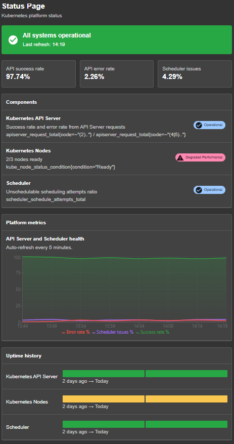
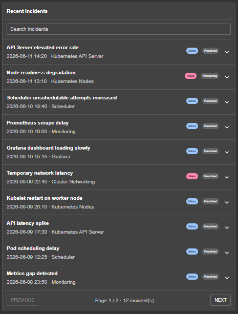

# Status Page Backstage

Simple status page plugin for Backstage.

It adds a `/statuspage` page where users can see the health of platform
services, metrics, components, and recent incidents.

## Preview

The page gives a quick overview of the platform health, live-looking metrics,
component status, and uptime history.



Users can also search incidents, see severity and status labels, and open each
incident to read more details.



## What you get

- Global status banner
- API success rate
- API error rate
- Scheduler issues
- Kubernetes component status
- 90-day uptime history
- Metrics chart
- Searchable incident history
- Expandable incident details

The plugin currently uses sample data. You can keep it as a demo page or replace
the sample data with your own monitoring data from Prometheus, Grafana,
PagerDuty, Opsgenie, Kubernetes, or your own backend API.

## Install

From your Backstage repository, install the plugin in your app:

```shell
yarn workspace app add NizmoDev/Status-Page-BackStage
```

If your frontend app package is not named `app`, replace `app` with your app
workspace name.

## Use with the new Backstage frontend system

Open your app entry point and add the plugin to `createApp`.

```ts
import statuspagePlugin from "status-page-backstage";

const app = createApp({
  features: [statuspagePlugin],
});
```

Then start Backstage and open:

```text
http://localhost:3000/statuspage
```

## Use with classic routes

If your app still uses React routes, add the page manually.

```tsx
import { StatusPagePage } from "status-page-backstage";

<Route path="/statuspage" element={<StatusPagePage />} />;
```

## Local development

Clone this repository, install dependencies, and start the plugin:

```shell
yarn install
yarn start
```

## Customize the data

The page data is in:

```text
src/components/StatusPagePage.tsx
```

Replace the sample services, incidents, and metric values with data from your
own systems.
